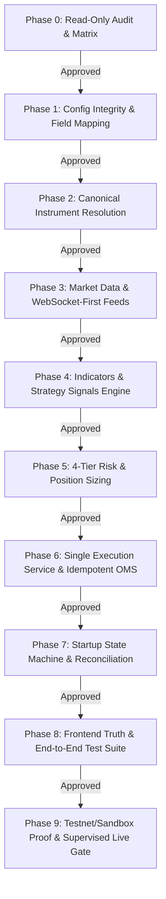

# Quant.OS Live-Trading Completion Plan (Phases 1–9)

**Document Version:** 3.0  
**Phase State:** Phase 0 Completed $\rightarrow$ Awaiting Human Approval for Phase 1  
**Architecture Core:** Next.js Frontend + Python FastAPI/Flask (:5050) + Market Gateway (:5051) + SQLite Persistence  

---

## Overview of Implementation Phases

---

## Phase 1: Configuration Integrity (Wizard to Backend)
**Goal:** Align every field in the 7-step bot creation wizard with `CanonicalBotConfig` and eliminate silent defaults or translation drops.
- Audit and reconcile:
  - `sizingMode` (frontend) $\leftrightarrow$ `sizing_method` (backend: `PERCENT_EQUITY`, `FIXED_QUANTITY`, `FIXED_NOTIONAL`, `RISK_PER_TRADE`, `VOLATILITY_ATR`)
  - `maxDailyLoss` $\leftrightarrow$ `max_daily_loss_amount` & `max_daily_loss_pct`
  - `selectedContractContext` $\leftrightarrow$ `universe` & `instrument` canonical context
  - Stop loss / take profit percentage and currency amount nesting
- Enforce deterministic `config_hash` generation (`SHA-256`) and versioning (`deployment_id`).
- Add strict validation tests asserting all wizard fields reach canonical storage or fail with descriptive error.
- **Phase 1 Gate:** `tsc --noEmit`, backend schema tests pass, zero missing fields.

---

## Phase 2: Canonical Instrument Resolution
**Goal:** Prevent raw unmapped symbol strings from ever reaching execution engines.
- Ensure `src/instrument_resolver.py` and `src/contract_resolver.py` resolve:
  - Canonical Instrument ID (`NSE_FO:...`, `DELTA:...`, `BINANCE:...`)
  - Exchange symbol, provider symbol, and broker order symbol
  - Underlying, strike, expiry, option type (`CE`/`PE`), side (`BUY`/`SELL`)
  - Lot size, tick size, and price precision
- Separate signal evaluation instrument (e.g. `BTC/USDT SPOT` or `NIFTY INDEX`) from execution instrument (e.g. `BTC 85800 PE` or `NIFTY 24650 CE`).
- **Phase 2 Gate:** Unit tests for valid, invalid, expired, and unmapped contracts.

---

## Phase 3: Market Data & WebSocket-First Feeds
**Goal:** Guarantee continuous live market tick streams with zero synthetic price fallbacks during live trading.
- Enforce WebSocket gateway (:5051) as primary data stream with automated heartbeat / ping-pong.
- Standardize normalized market tick payload: `symbol`, `canonical_instrument_id`, `exchange`, `provider`, `bid`, `ask`, `last`, `volume`, `timestamp`, `age_ms`, `is_stale`.
- Hard fail-closed gate: if tick age exceeds configured threshold (`maxTickAgeMs`), block all risk-increasing entries immediately.
- Integrate `CandleBuilder` for synchronized candle-close signal evaluation and REST-based historical gap recovery.
- **Phase 3 Gate:** Real WebSocket connection verification, disconnect/stale/out-of-order tick rejection tests.

---

## Phase 4: Indicators & Strategy Signals Engine
**Goal:** Deliver 100% end-to-end indicator calculations and pure signal emission (`HOLD`, `LONG`, `SHORT`, `EXIT`).
- Verify all 20 canonical indicators (EMA, SMA, RSI, MACD, Supertrend, Bollinger Bands, ATR, VWAP, Volume Profile, Order Flow, etc.) against known mathematical benchmarks.
- Separate strategy decision logic from order routing (strategies emit signal with confidence, reason, and timestamp).
- Any strategy/indicator not fully implemented must be explicitly disabled/flagged in UI and backend.
- **Phase 4 Gate:** Unit tests per indicator against reference datasets.

---

## Phase 5: 4-Tier Risk & Position Sizing
**Goal:** Centralize all pre-trade safety, sizing, and circuit breakers into `UniversalRiskEngine`.
- Implement and enforce 4 tiers:
  1. **Bot Risk:** Risk per trade, position size, SL, TP, trailing stop, max daily loss.
  2. **Account Risk:** Max daily account loss, max account drawdown, max open positions.
  3. **Portfolio Risk:** Total notional exposure, leverage limit, margin utilization cap, sector concentration.
  4. **System Risk:** Global kill-switch, broker disconnect policy, stale feed timeout.
- Implement sizing calculations: `PERCENT_EQUITY`, `FIXED_QUANTITY`, `FIXED_NOTIONAL`, `RISK_PER_TRADE`, `VOLATILITY_ATR`.
- **Phase 5 Gate:** Unit tests proving every risk threshold blocks order creation with exact reason.

---

## Phase 6: Single Execution Service & Idempotent OMS
**Goal:** Route 100% of orders, fills, and exits through `OrderExecutionService`.
- Establish `OrderIntent` schema: `client_order_id`, `command_id`, `bot_id`, `deployment_id`, `correlation_id`.
- Build strict order lifecycle: `INTENT` $\rightarrow$ `PREFLIGHT` $\rightarrow$ `SUBMITTED` $\rightarrow$ `ACKNOWLEDGED` $\rightarrow$ `PARTIAL` $\rightarrow$ `FILLED` $\rightarrow$ `RECONCILED`.
- Protect against network timeouts: query broker order status first; never blindly resubmit.
- Remove all direct database `INSERT/UPDATE/DELETE` from `live_runner.py` and worker scripts.
- **Phase 6 Gate:** Fake-broker integration harness passing with timeout, partial fill, and reject fault injections.

---

## Phase 7: Startup State Machine & Reconciliation
**Goal:** Eliminate unverified running states and enforce transactional position reconciliation.
- Multi-step startup state machine:
  `STOPPED` $\rightarrow$ `CONFIG_VALID` $\rightarrow$ `INSTRUMENT_RESOLVED` $\rightarrow$ `HISTORY_LOADED` $\rightarrow$ `INDICATORS_WARMED` $\rightarrow$ `DATA_CONNECTED` $\rightarrow$ `DATA_FRESH` $\rightarrow$ `BROKER_CONNECTED` $\rightarrow$ `ACCOUNT_VERIFIED` $\rightarrow$ `ORDERS_RECONCILED` $\rightarrow$ `POSITIONS_RECONCILED` $\rightarrow$ `RUNNING`.
- Startup and periodic reconciliation: cross-check internal positions and working orders against broker OMS.
- Safe lifecycle actions: Pause (entries blocked, exits active), Stop (entries blocked, reconcile, zero silent position drops), Delete (blocked if open positions or active orders exist).
- **Phase 7 Gate:** Reconciliation integration tests passing under injected discrepancy scenarios.

---

## Phase 8: Frontend Truth & End-to-End Test Suite
**Goal:** Complete visual fidelity where every UI badge and status represents actual runtime truth.
- Update Bot Fleet Commander, Control Plane, and Telemetry cards to consume real backend status (`RUNNING`, `PAUSED`, `STOPPED`, `ERROR`, `BLOCKED`, `WAITING_FOR_DATA`, `RECONCILIATION_REQUIRED`).
- Run complete test suite: backend unit tests, integration tests, frontend typecheck, and Next.js build.
- **Phase 8 Gate:** Zero test failures, zero lint/type errors.

---

## Phase 9: Testnet/Sandbox Proof & Supervised Live Gate
**Goal:** Prove live trading lifecycle on official broker sandbox/testnet before any live recommendation.
- Execute full paper and testnet lifecycle:
  1. Connected $\rightarrow$ 2. Resolved $\rightarrow$ 3. Deployed $\rightarrow$ 4. Intent $\rightarrow$ 5. Preflight $\rightarrow$ 6. Broker Ack $\rightarrow$ 7. Broker Order ID $\rightarrow$ 8. Status Verified $\rightarrow$ 9. Filled Qty Verified $\rightarrow$ 10. Fill Price Verified $\rightarrow$ 11. Position Verified $\rightarrow$ 12. Exit Submitted $\rightarrow$ 13. Exit Fill Verified $\rightarrow$ 14. Realized PnL Recorded.
- Provide Supervised Human Live Enablement Runbook for production launch.
- **Phase 9 Gate:** Captured audit evidence in `docs/EVIDENCE.md` meeting all Section 4C criteria.
