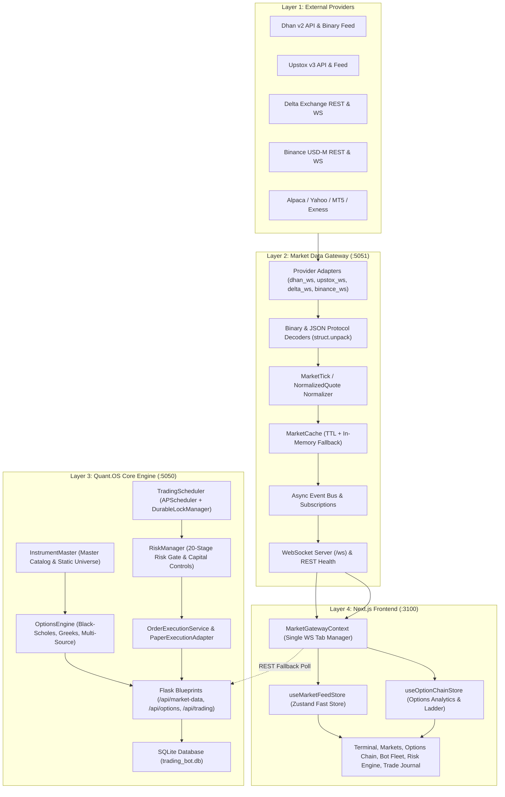

# Quant.OS — Current System Architecture Baseline

*Document Version: 1.0.0-PROD-BASELINE*
*Date: 2026-09-18*
*Target: Institutional-Grade Quant Architecture Review*

---

## 1. System Overview & Component Topology

Quant.OS is a multi-tier quantitative algorithmic trading platform organized into four distinct runtime layers:



---

## 2. Directory & Component Inventory

### 2.1 Frontend (`frontend/`)
- **Framework**: Next.js 14.2.35 (App Router & Pages Router hybrid, React 18, TypeScript).
- **Core Market Gateway Context**: `frontend/context/MarketGatewayContext.tsx`
  - Maintains single WebSocket connection to `ws://127.0.0.1:5051/ws`.
  - Reference-counted symbol subscriptions (`SubRef`).
  - Staleness watchdog (heartbeat check every 20s).
  - Out-of-order tick rejection based on ISO timestamps.
- **State Stores**:
  - `frontend/lib/market-data/market-feed-store.ts`: High-throughput quote store.
  - `frontend/lib/options/options-store.ts`: Option chain ladder, PCR, Max Pain, and Greeks.
  - `frontend/context/AuthContext.tsx`: Authentication and user session tokens.
- **UI Views**:
  - `/markets`: Live multi-category universe with 12 tabs (`WATCHLIST`, `ALL`, `STOCKS`, `INDICES`, `FUTURES`, `OPTIONS`, `FOREX`, `COMMODITIES`, `CRYPTO`, `BONDS`, `GLOBAL`, `MY POSITIONS`).
  - `/options`: Option Chain Workstation (Strike ladder, IV, Greeks, PCR, Max Pain, Quick Order Ticket).
  - `/terminal`: Real-time execution terminal with TradingView charts.
  - `/bots`: Multi-bot fleet manager with lifecycle controls.
  - `/risk`: Institutional risk control center.

### 2.2 Market Data Gateway (`market_data_gateway/`)
- **Port**: `5051`
- **Adapters**:
  - `market_data_gateway/adapters/dhan_ws.py`: Dhan v2 binary WebSocket feed (`<BHBI` header + `<fHIfIIIffff` quote body).
  - `market_data_gateway/adapters/upstox_ws.py`: Upstox v3 feed adapter.
  - `market_data_gateway/adapters/delta_ws.py`: Delta Exchange options & futures feed.
  - `market_data_gateway/adapters/binance_ws.py`: Binance USD-M futures feed.
- **Normalizer**: Produces canonical `NormalizedQuote` structures with `event_timestamp`, `received_timestamp`, `feed_latency_ms`, and `is_stale`.
- **Cache**: `market_data_gateway/cache/market_cache.py` (TTL-based in-memory cache with thread safety).

### 2.3 Backend Core Engine (`src/` & `app/`)
- **Port**: `5050` (Dual Bridge on `5000`)
- **Instrument Master**: `src/market_data/instrument_master.py` (Canonical instrument metadata across equities, indices, futures, options, crypto, forex).
- **Options Engine**: `src/market_data/options_engine.py` (Black-Scholes pricing, IV solver, Greeks, PCR, Max Pain, dynamic expiry/strike resolver).
- **Risk Management**: `src/risk_manager.py` (20-Stage Risk Gate, daily drawdown, max position limits, stop-loss, kill switch).
- **Scheduler**: `trading_orchestrator/scheduler/scheduler.py` (`TradingScheduler` with `DurableLockManager` and SHA-256 fingerprint deduplication).
- **Execution Service**: `src/execution_service.py` (`PaperExecutionAdapter` enforcing `TRADING_MODE=PAPER`, `LIVE_TRADING_ENABLED=false`).

---

## 3. Data Flow & Boundary Trace

```
1. Upstream Tick (e.g. Dhan / Delta)
      ↓
2. Gateway Adapter (Byte unpack / JSON parse)
      ↓
3. Normalizer (NormalizedQuote model)
      ↓
4. Gateway Cache & EventBus (PubSub)
      ↓
5. Gateway WS Server (/ws)
      ↓
6. Frontend MarketGatewayContext (Deduplication & Alias expansion)
      ↓
7. useMarketFeedStore / useOptionChainStore (Zustand)
      ↓
8. UI Component (OptionChainTable / MarketUniverseTable)
```

---

## 4. Current Blockers & Root Causes

### 4.1 Blockers Under Codebase Control
1. **Uninitialized Option Cache**: Fixed in `market_data_gateway/cache/market_cache.py`.
2. **Missing Blueprint Arguments**: Fixed in `app/blueprints/options.py`.
3. **Frontend Zero-Coercion on Unquoted Strikes**: Fixed in `frontend/app/api/options/flow/route.ts`, `frontend/types/option-terminal.ts`, and table components.
4. **Option Contract Universe Wipe on Auth Failure**: Fixed in `src/market_data/options_engine.py` via `_build_contract_universe_snapshot()`.

### 4.2 External Dependencies & Limitations
1. **Broker Daily Token Invalidation**: Indian brokers (Dhan, Upstox) invalidate OAuth tokens daily per SEBI mandate. Handled via graceful `AUTH_REQUIRED` status.
2. **Exchange Market Hours**: Off-market hours (outside 09:15–15:30 IST) emit no live ticks for Indian equities/derivatives. Handled via `MARKET CLOSED` / `LAST CLOSE` representation.
